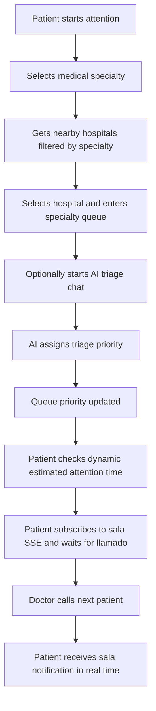

# Patient Flow

## Main Flow

## Steps

1. Patient selects a medical specialty.
2. Backend retrieves nearby hospitals from Google Places and filters by specialty stored locally.
3. Patient selects a hospital by `placeId` and `codigoEspecialidad`.
4. Backend creates or updates the active `ConsultaMedica` with the selected hospital and specialty.
5. The consultation enters the queue immediately: `EN_COLA` state and an `EntradaCola` with default priority are created.
6. Patient starts chat (optional).
7. Bot asks clinical questions.
8. When triage finishes, `Chat.resultadoTriageJson` is stored.
9. `nivelDeGravedadBot` is mapped from AI priority.
10. The existing `EntradaCola` priority is updated with the pretriage result.
11. Estimated attention time is returned dynamically via `EstimacionAtencionService` (`TiempoEstimadoAtencionResponse`).
12. When the patient enters `EN_COLA` (hospital selected or chat finalized) the frontend sets global `idConsultaActiva = consultaId` and subscribes to `GET /api/atencion/sala/suscribirse/{consultaId}` (`Accept: text/event-stream`, `Authorization: Bearer <jwt>` via EventSource polyfill). Only the owning patient may subscribe (`403` otherwise); the backend immediately sends `suscrito` and then `heartbeat` every 30s (`SalaAtencionNotifier`, separate `ConcurrentHashMap` from `TiempoEstimadoNotifier`).
13. When the doctor calls `POST /api/medico/sesiones/{id}/llamar-proximo`, the backend sets `LLAMADO` and emits `llamado NotificacionSalaDTO {consultaId, estadoConsulta, estadoEntradaCola, tipoPausa, fechaHoraLimiteRespuesta, codigoSala=Sala.nombre}` to all emitters for that `consultaId`. Previously the frontend polled `GET /api/paciente/consulta/estado` every 20s to discover the room; now the room is pushed in real time.
14. The frontend shows the room (`codigoSala`) as a push notification + screen. It keeps `heartbeat` while subscribed.
15. The frontend polls `GET /api/paciente/consulta/estado` every 20s; when `estadoConsulta` is `EN_ATENCION` or `FINALIZADA` it calls `GET /api/atencion/sala/desuscribirse/{consultaId}` (`204`) and clears `idConsultaActiva=null`. If marked `ATRASADO`/`EN_ESPERA` (ausente y atrasado) it does **not** unsubscribe — a later `llamarProximo` will emit a new `llamado`.

## Waiting And Absence Rules

If patient manually leaves the waiting queue:

- `EntradaCola.estado = EN_ESPERA`
- `tipoPausa = ESPERA_MANUAL`
- They do not count for estimation while waiting outside queue.
- When they return, they keep their previous relative position.

If doctor calls patient and patient is absent:

- Doctor marks them absent manually.
- Patient becomes `EN_ESPERA` with `AUSENTE_AL_LLAMADO`.
- Patient can confirm they are delayed.
- The one-hour waiting deadline starts when the doctor marks the called patient absent.

If patient confirms delayed:

- State becomes `ATRASADO`.
- They are not in queue until they mark arrival.
- Backend asks again every 30 minutes through deadline state.
- If they do not respond, they are cancelled by scheduler.

If delayed patient arrives:

- They return to first place within their priority level.

## Waiting Expiration

Both manual waiting and absence-after-call entries are automatically cancelled after one hour in `EN_ESPERA`:

- `EntradaCola.estado = CANCELADA`
- `ConsultaMedica.estadoConsulta = CANCELADA`
- Persisted records remain as history but no longer belong to the active queue.

## Medical Studies Management

Patients can manage their medical study files (radiology scans, lab reports, etc.) independently of the attention flow:

### Upload Study

- Patient uploads a file through `POST /api/estudios` with multipart form data.
- File is stored in AWS S3 through `GestionDeArchivosService`.
- An `EstudioClinico` record is created with metadata (type, description, file size, upload date).
- The record is linked to the authenticated patient.

### List And View Studies

- `GET /api/estudios` returns all active studies for the authenticated patient.
- `GET /api/estudios/{idEstudio}` returns metadata for a specific study.
- `GET /api/estudios/{idEstudio}/file` downloads the actual file from S3.

### Delete Study

- `DELETE /api/estudios/{idEstudio}` performs soft delete on the `EstudioClinico` record.
- The file is first deleted from S3.
- If S3 deletion fails, the database record is not modified (atomic operation).
- The entity's `activo` field is set to `false` to preserve history while removing from active views.

### Doctor Access

During attention, doctors can view patient studies through the medical history endpoints documented in the API reference.