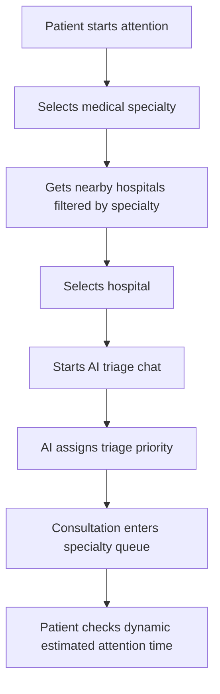

# Patient Flow

## Main Flow

## Steps

1. Patient selects a medical specialty.
2. Backend retrieves nearby hospitals from Google Places and filters by specialty stored locally.
3. Patient selects a hospital by `placeId` and `codigoEspecialidad`.
4. Backend creates or updates the active `ConsultaMedica`.
5. Patient starts chat.
6. Bot asks clinical questions.
7. When triage finishes, `Chat.resultadoTriageJson` is stored.
8. `nivelDeGravedadBot` is mapped from AI priority.
9. The consultation becomes `EN_COLA`.
10. An `EntradaCola` is created or reused.
11. Estimated attention time is returned dynamically.

## Waiting And Absence Rules

If patient manually leaves the waiting queue:

- `EntradaCola.estado = EN_ESPERA`
- `tipoPausa = ESPERA_MANUAL`
- They do not count for estimation while waiting outside queue.
- When they return, they keep their previous relative position.

If doctor calls patient and patient is absent:

- Doctor marks them absent manually.
- Patient becomes `EN_ESPERA` with `AUSENTE_AL_LLAMADO`.
- Patient can confirm they are delayed.
- The one-hour waiting deadline starts when the doctor marks the called patient absent.

If patient confirms delayed:

- State becomes `ATRASADO`.
- They are not in queue until they mark arrival.
- Backend asks again every 30 minutes through deadline state.
- If they do not respond, they are cancelled by scheduler.

If delayed patient arrives:

- They return to first place within their priority level.

## Waiting Expiration

Both manual waiting and absence-after-call entries are automatically cancelled after one hour in `EN_ESPERA`:

- `EntradaCola.estado = CANCELADA`
- `ConsultaMedica.estadoConsulta = CANCELADA`
- Persisted records remain as history but no longer belong to the active queue.