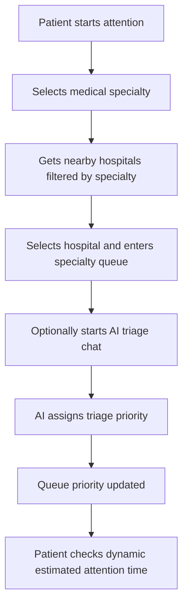

# Patient Flow

## Main Flow

## Steps

1. Patient selects a medical specialty.
2. Backend retrieves nearby hospitals from Google Places and filters by specialty stored locally.
3. Patient selects a hospital by `placeId` and `codigoEspecialidad`.
4. Backend creates or updates the active `ConsultaMedica` with the selected hospital and specialty.
5. The consultation enters the queue immediately: `EN_COLA` state and an `EntradaCola` with default priority are created.
6. Patient starts chat (optional).
7. Bot asks clinical questions.
8. When triage finishes, `Chat.resultadoTriageJson` is stored.
9. `nivelDeGravedadBot` is mapped from AI priority.
10. The existing `EntradaCola` priority is updated with the pretriage result.
11. Estimated attention time is returned dynamically.

## Waiting And Absence Rules

Endpoints in this section are implemented in `PacienteEsperaController` / `EsperaPacienteService` (`docs/06-api-reference.md#patient-queue-state`).

If patient manually leaves the waiting queue (`POST /api/paciente/consulta/cola/pausa-manual` — `EsperaPacienteService.ausentarme`, requires `EN_COLA`):

- `EntradaCola.estado = EN_ESPERA`
- `tipoPausa = ESPERA_MANUAL`
- They do not count for estimation while waiting outside queue.
- When they return (`POST /api/paciente/consulta/cola/reincorporar`), they keep their previous relative position (keeps `ordenRelativo`).

If doctor calls patient and patient is absent:

- Doctor marks them absent manually.
- Patient becomes `EN_ESPERA` with `AUSENTE_AL_LLAMADO`.
- Patient can confirm they are delayed (`POST /api/paciente/consulta/cola/atraso/confirmar` — requires `EN_ESPERA+AUSENTE_AL_LLAMADO`).
- The one-hour waiting deadline starts when the doctor marks the called patient absent.

If patient confirms delayed (`POST /api/paciente/consulta/cola/atraso/confirmar` → `POST /api/paciente/consulta/cola/atraso/renovar`):

- State becomes `ATRASADO` (`ATRASADO_CONFIRMADO`, `fechaHoraLimiteRespuesta=now+30m`).
- They are not in queue until they mark arrival (`POST /api/paciente/consulta/cola/reincorporar`).
- Backend asks again every 30 minutes through deadline state (`sigoAsistiendo` → now `renovarConfirmacionAtraso` extends `+30m`).
- If they do not respond, they are cancelled by scheduler (`cancelarAtrasadosSinRespuesta`).

If delayed patient arrives (`POST /api/paciente/consulta/cola/reincorporar` from `ATRASADO`):

- They return to first place within their priority level (`obtenerOrdenParaPrimerLugarDePrioridad`: `min(ordenRelativo)-1` for that `prioridad`).

## Waiting Expiration

Both manual waiting (`POST /api/paciente/consulta/cola/pausa-manual`) and absence-after-call / `ATRASADO` entries are automatically cancelled after their deadline in `EN_ESPERA`/`ATRASADO` (60m for `EN_ESPERA`, 30m windows for `ATRASADO` via `EsperaPacienteService.cancelarEsperasVencidas` / `cancelarAtrasadosSinRespuesta`):

- `EntradaCola.estado = CANCELADA`
- `ConsultaMedica.estadoConsulta = CANCELADA`
- Persisted records remain as history but no longer belong to the active queue.

## Medical Studies Management

Patients can manage their medical study files (radiology scans, lab reports, etc.) independently of the attention flow:

### Upload Study

- Patient uploads a file through `POST /api/estudios` with multipart form data.
- File is stored in AWS S3 through `GestionDeArchivosService`.
- An `EstudioClinico` record is created with metadata (type, description, file size, upload date).
- The record is linked to the authenticated patient.

### List And View Studies

- `GET /api/estudios` returns all active studies for the authenticated patient.
- `GET /api/estudios/{idEstudio}` returns metadata for a specific study.
- `GET /api/estudios/{idEstudio}/file` downloads the actual file from S3.

### Delete Study

- `DELETE /api/estudios/{idEstudio}` performs soft delete on the `EstudioClinico` record.
- The file is first deleted from S3.
- If S3 deletion fails, the database record is not modified (atomic operation).
- The entity's `activo` field is set to `false` to preserve history while removing from active views.

### Doctor Access

During attention, doctors can view patient studies through the medical history endpoints documented in the API reference.