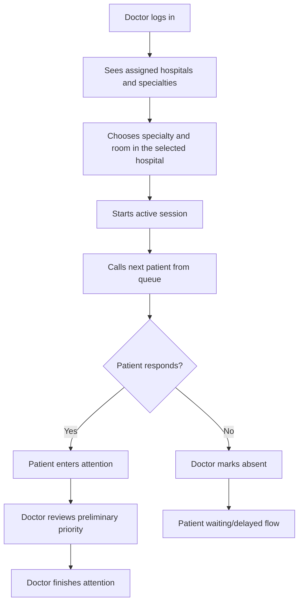

# Doctor Flow

## Main Flow

## Session Rules

- A doctor is already assigned to hospitals and specialties by the admin domain.
- A doctor starts a session by choosing hospital, specialty, and room.
- A doctor cannot change specialty inside a session.
- To change specialty, close the current session and start another.
- A room can be used by one doctor at a time.
- A doctor can have one active or paused session at a time.
- After a reload or new login, the active or paused session and any `LLAMADO` or
  `EN_ATENCION` consultation are recovered from the backend.
- A paused session continues reserving the doctor and room, although it does not count as estimation capacity.
- A doctor cannot pause or close a session while a consultation is LLAMADO or EN_ATENCION.
- A doctor cannot call another patient while a previous patient is still LLAMADO or EN_ATENCION.

## Session States

- `ACTIVA`: doctor is attending and counts for estimation.
- `PAUSADA`: doctor is temporarily absent and does not count for estimation.
- `FINALIZADA`: session closed.

## Calling Patients

When doctor calls next patient:

- Backend selects next `EntradaCola.EN_COLA` for the same hospital/specialty.
- Ordering is by priority descending and relative order ascending.
- Entry becomes `LLAMADO`.
- Consultation also becomes `LLAMADO`.

If patient appears:

- Entry becomes `EN_ATENCION`.
- Consultation becomes `EN_ATENCION`.
- Doctor, room, and session context are assigned.
- An `AtencionMedica.EN_CURSO` historical record is created and linked to the consultation and session.

If patient does not respond:

- Doctor marks absent manually.
- Entry becomes `EN_ESPERA`.
- `tipoPausa = AUSENTE_AL_LLAMADO`.
- Patient decides whether they are delayed or returning.

## Completing Attention

When attention finishes:

- The doctor must first confirm the preliminary priority or correct it.
- Confirmation is a one-click action. A correction requires a different priority; its short reason is optional.
- Each genuine review change creates an append-only `RevisionPrioridadConsulta` record with doctor, previous and new priority, decision, optional reason, and timestamp.
- Repeating the exact same review is idempotent and does not duplicate history.
- The current effective value is also stored in `ConsultaMedica.nivelDeGravedadMedico` for direct reads. Reviewing it does not reorder an entry that is already `EN_ATENCION`.
- Priority can be changed again while attention remains open, but never after finalization.
- `EntradaCola` and `ConsultaMedica` become `FINALIZADA`.
- The linked `AtencionMedica` becomes `FINALIZADA` and stores its end time.

The authorized clinical summary and review state are available at
`GET /api/medico/sesiones/{sesionId}/consultas/{consultaId}/pretriaje`.
`PUT /api/medico/sesiones/{sesionId}/consultas/{consultaId}/revision-prioridad`
accepts `CONFIRMAR`, or `CORREGIR` with a required different `prioridad` and an
optional `motivo` of at most 500 characters. Finalization returns `409` while
the review is pending.

## Queue Visibility And History

- `GET /api/medico/asignaciones` returns the doctor's hospital and specialty assignments.
- `GET /api/hospitales/{hospitalId}/salas?codigoEspecialidad={codigoEspecialidad}` returns the active rooms of a hospital for the given specialty.
- `GET /api/medico/sesiones/actual` returns the authenticated doctor's active or
  paused session and their currently called or in-attention consultation, if present.
- `GET /api/medico/sesiones/{sesionId}/pacientes-disponibles` lists ordered `EN_COLA` patients for the session hospital and specialty, including the preliminary priority and the patient name and surname authorized for the attending doctor. A room is not present until the patient is called.
- `GET /api/medico/atenciones` returns the authenticated doctor's historical attention records.

## Clinical History Access

When attending patients, doctors can access their medical records:

- `GET /api/medico/pacientes/{pacienteId}/historial-clinico` retrieves all medical records (PDFs, images) for a specific patient.
- `GET /api/medico/pacientes/{pacienteId}/historial-clinico/{estudioId}/archivo` downloads or previews a specific medical record file.
- `GET /api/medico/pacientes/{pacienteId}/historial-clinico/{estudioId}/reporte` retrieves structured information about a specific medical record.
- `GET /api/medico/pacientes/{pacienteId}/ultimos-reportes` gets the most recent medical records for quick triage reference.
