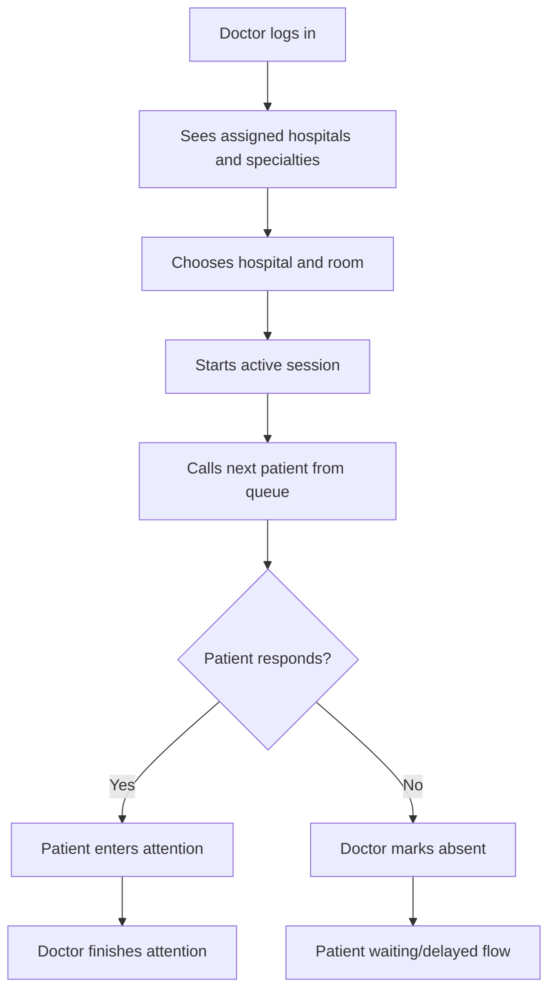

# Doctor Flow

## Main Flow

## Session Rules

- A doctor is already assigned to hospitals and specialties by the admin domain.
- A doctor starts a session by choosing hospital, specialty, and room.
- A doctor cannot change specialty inside a session.
- To change specialty, close the current session and start another.
- A room can be used by one doctor at a time.
- A doctor can have one active or paused session at a time.

## Session States

- `ACTIVA`: doctor is attending and counts for estimation.
- `PAUSADA`: doctor is temporarily absent and does not count for estimation.
- `FINALIZADA`: session closed.

## Calling Patients

When doctor calls next patient:

- Backend selects next `EntradaCola.EN_COLA` for the same hospital/specialty.
- Ordering is by priority descending and relative order ascending.
- Entry becomes `LLAMADO`.
- Consultation also becomes `LLAMADO`.

If patient appears:

- Entry becomes `EN_ATENCION`.
- Consultation becomes `EN_ATENCION`.
- Doctor, room, and session context are assigned.

If patient does not respond:

- Doctor marks absent manually.
- Entry becomes `EN_ESPERA`.
- `tipoPausa = AUSENTE_AL_LLAMADO`.
- Patient decides whether they are delayed or returning.
