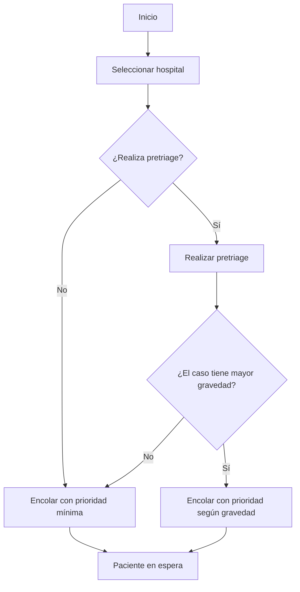
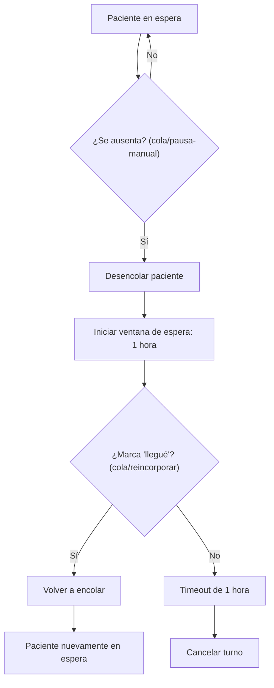
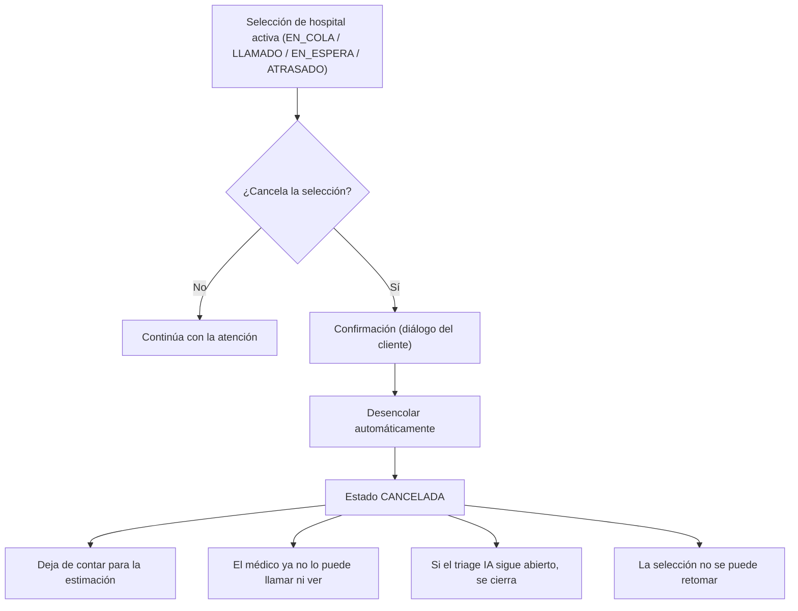
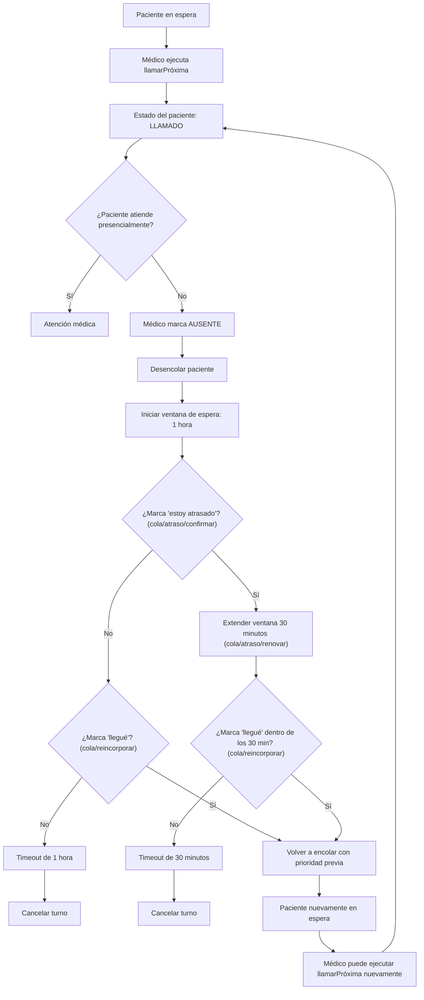

1. Flujo normal: selección, pretriage y encolamiento

2. Flujo de ausencia y atraso (`POST /api/paciente/consulta/cola/pausa-manual` → `POST /api/paciente/consulta/cola/reincorporar`)

3. Flujo de cancelación voluntaria (`POST /api/paciente/consulta/cancelar`)

Nota: `EN_ATENCION` (consulta en curso) y `FINALIZADA` no son cancelables (`409 ConflictoDeEstadoException`). La cancelación es idempotente: un segundo intento sobre una entrada ya `CANCELADA` responde exitoso sin cambios. Fuera de alcance: admisiones de recepción (se cancelan con `POST /api/recepcion/admisiones/{admisionId}/cancelar`).
4. Flujo de llamado médico, ausencia y reencolamiento (`cola/atraso/confirmar` / `cola/atraso/renovar` / `cola/reincorporar`)

