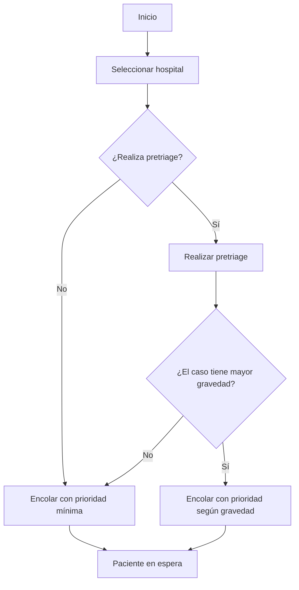
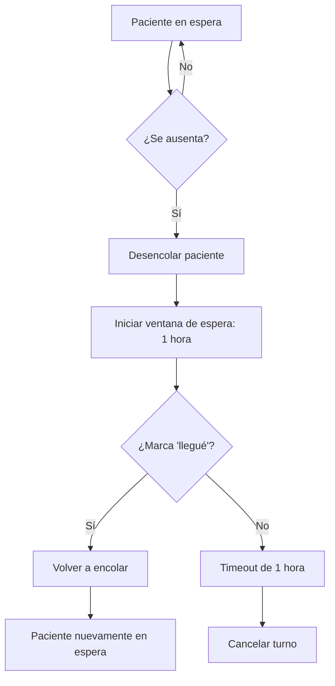
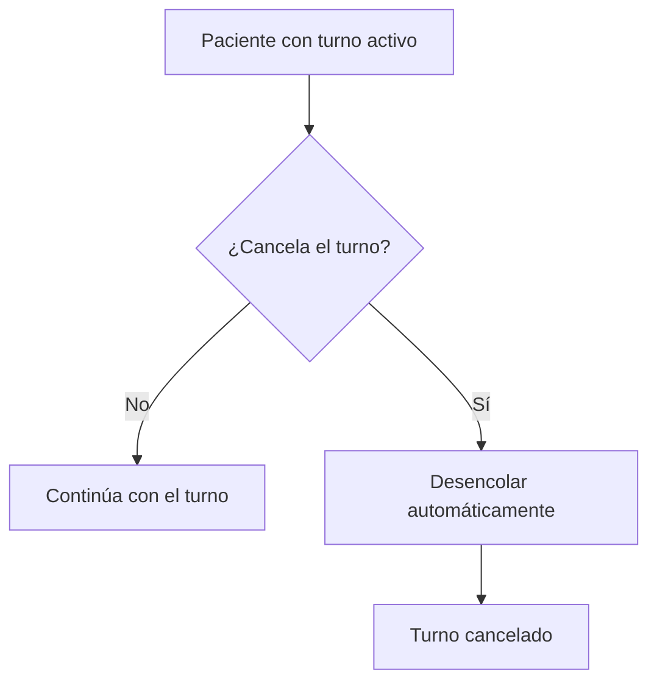
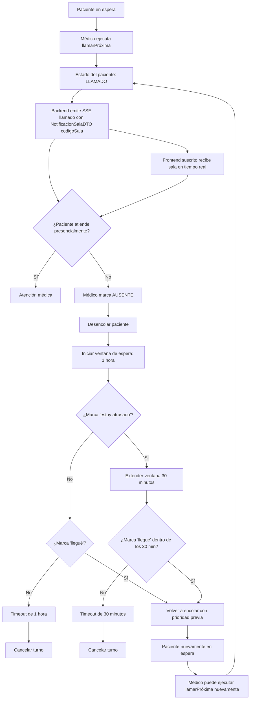
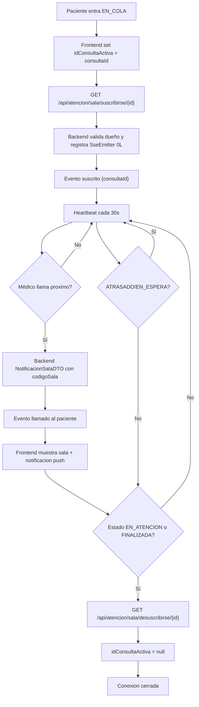

1. Flujo normal: selección, pretriage y encolamiento

2. Flujo de ausencia y atraso

3. Flujo de cancelación voluntaria

4. Flujo de llamado médico, ausencia y reencolamiento

5. Flujo SSE de sala (tiempo real, independiente de tiempo-estimado)

