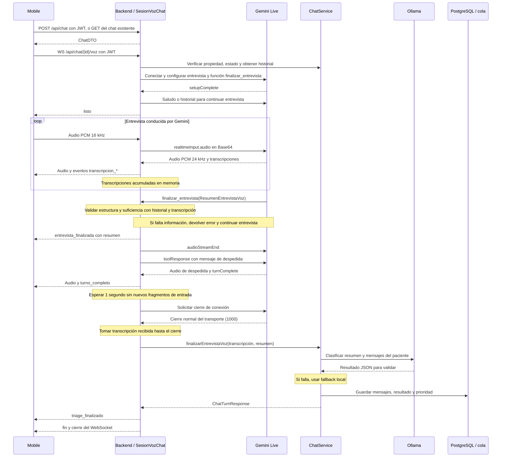

# Chat de voz: mobile, backend y Gemini Live

Integración de la rama `feature/chat-voz-gemini-live`, revisada y corregida sobre `921a8d2` el 29 de septiembre de 2026.

Gemini Live ahora conduce la entrevista directamente por voz: escucha, pregunta y responde con audio. Cuando decide cerrar, entrega un resumen al backend. Después de la despedida, el backend llama a Ollama para preclasificar, guarda la transcripción y actualiza la cola. El chat de texto conserva su flujo de preguntas con Ollama.

La versión anterior usaba Gemini para transcribir cada respuesta y leer las preguntas de Ollama. Esa arquitectura quedó reemplazada en voz: ya no existe la función `registrar_respuesta_paciente` ni se emite `turno_bot` por cada respuesta hablada.

## Responsabilidades

| Componente | Responsabilidad actual |
| --- | --- |
| Mobile | Capturar y enviar audio, reproducirlo, mostrar transcripciones y distinguir entrevista terminada de clasificación terminada. |
| API HTTP del backend | Crear y consultar el `Chat`; mantener el canal de texto existente. |
| WebSocket del backend | Autenticar al paciente y conectar el canal mobile con Gemini. |
| `SesionVozChat` | Acumular transcripciones, recibir el resumen, coordinar la despedida y solicitar la preclasificación. |
| Gemini Live | Conducir la entrevista y llamar a `finalizar_entrevista`. El prompt indica que no asigne prioridad. |
| `ChatService` + Ollama | Preclasificar el resumen y la transcripción del paciente, validar la salida y aplicar el fallback local si corresponde. |
| PostgreSQL y servicios de cola | Guardar mensajes, resultado final y prioridad de la consulta. |

Hay dos WebSockets: mobile ↔ backend y backend ↔ Google. La clave `GEMINI_API_KEY` permanece en el servidor. El backend no guarda grabaciones de audio en este flujo.

## Secuencia actual

La consulta mantiene el requisito de selección previa de especialidad y hospital para completar el triage y actualizar la cola. Crear un chat o abrir su canal de voz no realiza esa selección. Ver [flujo del paciente](02-patient-flow.md).

En un chat nuevo, Gemini recibe el saludo inicial. Si ya hay respuestas, recibe el historial para continuar la entrevista. Durante la conversación el backend no consulta Ollama por cada intervención ni persiste cada fragmento: reúne turnos `TurnoVoz` en memoria. Al llegar a 12 respuestas le pide a Gemini que cierre; es una instrucción al modelo, no un cierre obligatorio del servidor.

`finalizar_entrevista` recibe motivo, síntomas, inicio, evolución, dolor, alarmas, antecedentes, medicación, alergias, embarazo y observaciones mediante `ResumenEntrevistaVoz`. No recibe prioridad. El validador compartido exige estructura válida y al menos una respuesta del paciente. En el caso normal exige al menos tres respuestas y evidencia de motivo, inicio, gravedad o evolución, exploración de alarmas y contexto clínico. Una alarma significativa o alcanzar 12 respuestas permite cerrar con datos incompletos, pero no con `{}` ni sin respuestas. Ante rechazo, la función devuelve un error y conserva la conversación para continuar. `ChatService` repite esta validación antes de modificar el chat o consultar Ollama.

Una vez aceptado el cierre, la sesión detiene el envío de audio del micrófono y envía `audioStreamEnd`. Espera audio o transcripción de la despedida, su `turnComplete` y una ventana de un segundo sin nuevos fragmentos de entrada. Cada fragmento tardío reinicia esa ventana. Después solicita el cierre de Gemini y sigue recibiendo transcripciones hasta la confirmación normal del transporte (`1000`); recién entonces toma la instantánea y clasifica una sola vez. Un cierre normal iniciado por el proveedor también permite completar este paso.

Hay un límite total de 30 segundos desde que se acepta la función, independiente del tiempo posterior de Ollama. Si vence, falla la conexión o llega un cierre anormal, se intenta guardar la transcripción sin finalizar el chat y se emiten `error` y `fin`; no se clasifica una entrevista con cierre sin confirmar. La ventana reduce la pérdida de fragmentos tardíos, pero no garantiza recuperar texto que Google nunca envíe antes del cierre: `turnComplete` no confirma que haya terminado la transcripción de entrada.

`ChatService.finalizarEntrevistaVoz` agrega la transcripción al chat y solicita a Ollama una respuesta final. El prompt indica que, si el resumen contradice al paciente, prevalece la transcripción. Si hay alarmas detectadas localmente o declaradas en el resumen, exige prioridad al menos 4 y atención inmediata; en caso contrario usa fallback. La clasificación final actualiza `Chat.resultadoTriageJson`, el resumen de la consulta y la prioridad de su entrada en cola.

El fallback también prioriza los datos extraídos de la transcripción: conserva inicio y evolución conocidos, usa la última intensidad explícita válida y respeta negaciones de síntomas, antecedentes, medicación y alergias. Los marcadores como «no informado» y las alarmas negadas no se convierten en hallazgos positivos. Los extractores son reglas lingüísticas acotadas, no una interpretación completa del lenguaje; por eso se conserva el texto literal del paciente en observaciones.

## Contrato de mobile

El endpoint sigue siendo `/api/chat/{id}/voz`. Admite JWT por `Authorization: Bearer` o por `?access_token=` en esta ruta. El detalle de mensajes y rechazos del handshake está en la [referencia de API](06-api-reference.md#voice-chat-gemini-live).

| Evento o mensaje | Acción del cliente |
| --- | --- |
| `listo` | Habilitar envío de audio. Los datos anteriores se descartan. |
| Audio enviado | PCM crudo de 16 bits, mono, little-endian, a 16 kHz; hasta 256 KiB por mensaje binario. El backend no convierte codecs. |
| Audio recibido | Reproducir PCM de 16 bits, mono, little-endian, a 24 kHz. |
| `transcripcion_paciente`, `transcripcion_bot` | Mostrar texto incremental. No son confirmaciones de guardado. |
| `interrumpido` | Interrumpir la reproducción y vaciar el audio pendiente. |
| `turno_completo` | Terminó un turno de Gemini; no equivale a triage finalizado. |
| `entrevista_finalizada` | Detener micrófono y mostrar preclasificación pendiente. El resumen todavía no contiene una prioridad final. |
| `triage_finalizado` | Mostrar `respuesta` y `atencionEstimada`. `origenRespuesta` indica `OLLAMA` o `FALLBACK_LOCAL`. |
| `fin` o cierre del socket | Terminar la sesión; si falta `triage_finalizado`, consultar el estado del chat por HTTP. |
| `error`, `sesion_por_expirar` | Mostrar el estado y preparar recuperación por texto o una sesión nueva, según el estado persistido. |

Mobile debe conservar el socket del backend tras `entrevista_finalizada`: el resultado llega después, por `triage_finalizado`. La respuesta final de Ollama se entrega como texto; Gemini ya terminó su sesión y no la lee. El cliente debe dejar reproducir el audio de despedida que haya recibido.

`{"tipo":"fin_audio"}` indica pausa del micrófono y se traduce a `audioStreamEnd`. `{"tipo":"cerrar"}` cierra el canal. Antes de finalizar la entrevista, el backend intenta guardar lo acumulado sin clasificar; después de aceptar el cierre de Gemini, la clasificación pendiente continúa aunque mobile se desconecte. No enviar las transcripciones nuevamente por el endpoint de texto: se duplicarían.

## Persistencia y recuperación

El guardado de una sesión interrumpida es asíncrono. El cierre del socket no confirma que la transcripción ya esté disponible para una reconexión inmediata. Si falla la preclasificación, se intenta guardar mediante `registrarTurnosVoz` y se informa un error. No hay reanudación de sesión de Google ni coordinación global entre envíos por HTTP y WebSocket.

`fin` también puede representar una desconexión de Gemini sin entrevista completa. Para conocer el estado persistido se usa `GET /api/chat/{id}`; para el estado de atención se conserva el flujo de consulta y cola. Si el proceso del backend termina abruptamente durante la entrevista, los turnos que solo estaban en memoria todavía no se guardaron.

## Regresiones y verificación

Las pruebas versionadas cubren los tres defectos observados en la revisión inicial:

| Defecto | Comportamiento verificado |
| --- | --- |
| Resumen contradice la transcripción | Con fallo de Ollama, «desde ayer, dolor 8/10» prevalece sobre «hoy, dolor 2»; el caso sintético conserva dolor 8, inicio ayer y prioridad 4. |
| Cierre sin información suficiente | `{}` se rechaza sin consultar Ollama ni guardar una clasificación; la entrevista puede continuar y finalizar luego con información suficiente. |
| Transcripción tardía descartada | Se aceptan fragmentos después de `turnComplete` y hasta confirmar el cierre; se reinicia la ventana de drenaje y se clasifica una vez. También se prueban timeout, cierre anormal, callbacks duplicados y desconexión de mobile. |

`SesionVozIntegracionTest` combina la sesión, el validador y `ChatService` reales con repositorios y proveedores simulados. `SesionVozChatTest` usa un reloj controlado para comprobar vencimientos sin pausas de tiempo real. No se probó micrófono de mobile ni una sesión real de Gemini. Los comandos reproducibles están en [desarrollo local](07-local-development.md#voice-chat-regression-tests).

Verificación del 29 de septiembre de 2026: **82 pruebas focalizadas**, **310 pruebas Java en la suite completa** y **11 pruebas Python**, sin fallos. La suite completa usó PostgreSQL en una base aislada; las 82 focalizadas forman parte de las 310. Los contextos de aplicación arrancan con servidor en puerto aleatorio y verifican el contenedor WebSocket y sus límites.

El checkout mobile local consultado (`pretriage_frontend_mobile`, commit `51d74dc`) no contiene referencias a los eventos ni al WebSocket de voz en los archivos Kotlin versionados. Esto no permite confirmar una integración mobile terminada ni evaluar otra rama remota de mobile.

## Referencias y configuración

- [SesionVozChat](../src/main/java/com/pretriage/backend/services/voz/SesionVozChat.java): entrevista, transcripciones, función de cierre y eventos.
- [ChatService](../src/main/java/com/pretriage/backend/services/ChatService.java): clasificación, fallback y persistencia.
- [ChatVozHandshakeInterceptor](../src/main/java/com/pretriage/backend/controllers/ChatVozHandshakeInterceptor.java) y [ChatVozWebSocketHandler](../src/main/java/com/pretriage/backend/controllers/ChatVozWebSocketHandler.java): autorización y canal cliente.
- [GeminiLiveCliente](../src/main/java/com/pretriage/backend/services/voz/GeminiLiveCliente.java): conexión con Google.
- [Configuración local](07-local-development.md): `GEMINI_API_KEY`, modelo, voz, idioma y orígenes. El modelo por defecto es `models/gemini-3.8-live`; una configuración no vacía no comprueba su disponibilidad real.
- [Referencia oficial de Gemini Live](https://ai.google.dev/api/live): protocolo y ausencia de orden garantizado para `inputTranscription`.
