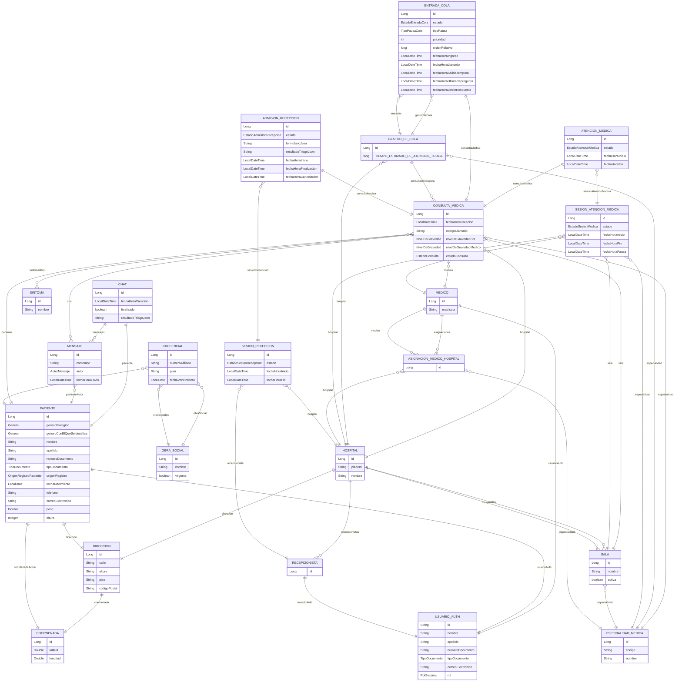

# Generated Domain Model

This file is generated from JPA entity classes under:

```text
src/main/java/com/pretriage/backend/model
```

Regenerate with:

```powershell
python scripts\generate_domain_diagram.py
```

## Entities

- `AdmisionRecepcion`: `src/main/java/com/pretriage/backend/model/recepcion/AdmisionRecepcion.java`
- `AsignacionMedicoHospital`: `src/main/java/com/pretriage/backend/model/personas/AsignacionMedicoHospital.java`
- `AtencionMedica`: `src/main/java/com/pretriage/backend/model/consultas/AtencionMedica.java`
- `Chat`: `src/main/java/com/pretriage/backend/model/chat/Chat.java`
- `ConsultaMedica`: `src/main/java/com/pretriage/backend/model/consultas/ConsultaMedica.java`
- `Coordenada`: `src/main/java/com/pretriage/backend/model/hospitales/Coordenada.java`
- `Credencial`: `src/main/java/com/pretriage/backend/model/hospitales/Credencial.java`
- `Direccion`: `src/main/java/com/pretriage/backend/model/hospitales/Direccion.java`
- `EntradaCola`: `src/main/java/com/pretriage/backend/model/consultas/EntradaCola.java`
- `EspecialidadMedica`: `src/main/java/com/pretriage/backend/model/hospitales/EspecialidadMedica.java`
- `GestorDeCola`: `src/main/java/com/pretriage/backend/model/consultas/GestorDeCola.java`
- `Hospital`: `src/main/java/com/pretriage/backend/model/hospitales/Hospital.java`
- `Medico`: `src/main/java/com/pretriage/backend/model/personas/Medico.java`
- `Mensaje`: `src/main/java/com/pretriage/backend/model/chat/Mensaje.java`
- `ObraSocial`: `src/main/java/com/pretriage/backend/model/hospitales/ObraSocial.java`
- `Paciente`: `src/main/java/com/pretriage/backend/model/personas/Paciente.java`
- `Recepcionista`: `src/main/java/com/pretriage/backend/model/personas/Recepcionista.java`
- `Sala`: `src/main/java/com/pretriage/backend/model/hospitales/Sala.java`
- `SesionAtencionMedica`: `src/main/java/com/pretriage/backend/model/consultas/SesionAtencionMedica.java`
- `SesionRecepcion`: `src/main/java/com/pretriage/backend/model/recepcion/SesionRecepcion.java`
- `Sintoma`: `src/main/java/com/pretriage/backend/model/consultas/Sintoma.java`
- `UsuarioAuth`: `src/main/java/com/pretriage/backend/model/personas/UsuarioAuth.java`

## Mermaid ER Diagram


